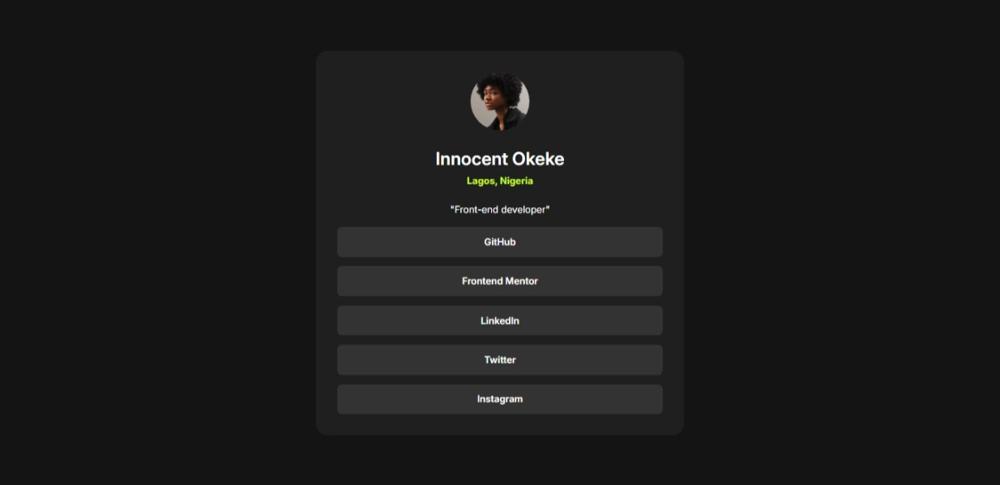

This is a solution to the [Social links profile challenge on Frontend Mentor](https://www.frontendmentor.io/challenges/social-links-profile-UG32l9m6dQ). Frontend Mentor challenges help you improve your coding skills by building realistic projects.

## Table of contents

- [Overview](#overview)
  - [Screenshot](#screenshot)
  - [Links](#links)
- [My process](#my-process)
  - [Built with](#built-with)
- [Author](#author)

## Overview

### Screenshot

### Links

- Solution URL: [GitHub](https://github.com/Innocent-Leo/social-links-profile.git)
- Live Site URL: [Netlify](https://socialmedia-links-profile.netlify.app/)

## My process

### Built with

- HTML5 markup
- CSS custom properties
- Flexbox
- Mobile-first workflow

## Author

<!-- - Website - [Add your name here](https://www.your-site.com) -->

- Frontend Mentor - [@Innocent-Leo](https://www.frontendmentor.io/profile/Innocent-Leo)
- Twitter - [@itz_saintleo](https://www.twitter.com/itz_saintleo)
- LinkedIn - [@Innocent-Okeke](https://www.linkedin.com/in/innocent-okeke)
